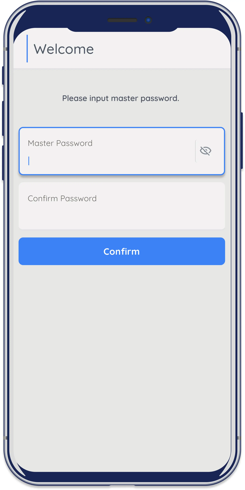
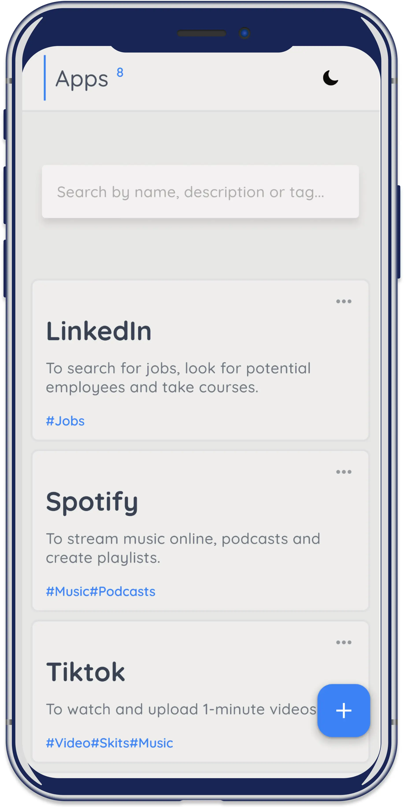
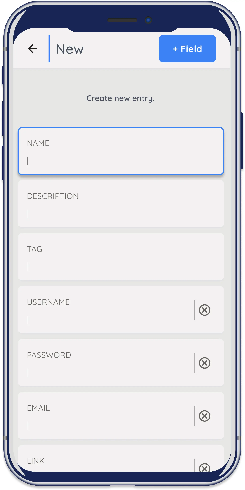
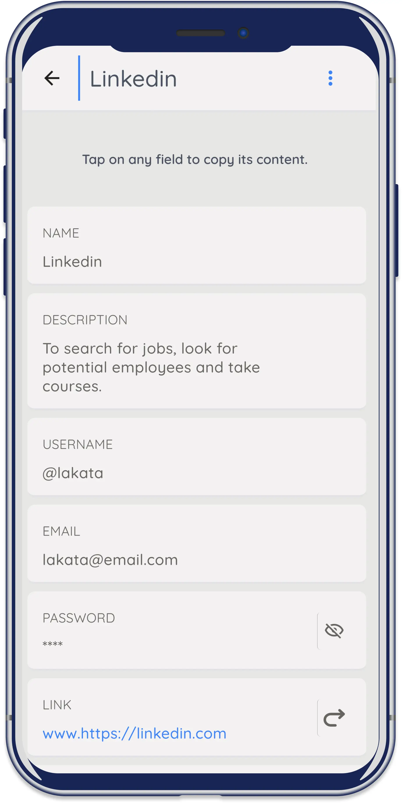

This is a [Next.js](https://nextjs.org/) project bootstrapped with [`create-next-app`](https://github.com/vercel/next.js/tree/canary/packages/create-next-app).

# Appledger

<kbd><p>
App directory for saving login credentials. This innovative application not
only stores your login credentials but
also makes it
conveniently easy to retrieve them
. No more worrying about forgetting your passwords or usernames.
With Appledger, you can enjoy a more
visual and user-friendly approach
to password management.

</p></kbd>

## Site

Visit the live site [here](https://appledger.vercel.app)

## Figma

You can test the [prototype](https://www.figma.com/proto/E84xZikI87orYzxNaKlw7f/appLedger?type=design&node-id=34-441&t=3sgzyFApyqC663qq-0&scaling=scale-down&starting-point-node-id=384%3A304) created in Figma.

## Case-study

Learn more by reading the full [case-study](https://pixelayo.vercel.app/ayo/case-study/appledger) on my portfolio website.

## Table of Contents

- [Introduction](#introduction)
- [Tech Stack](#tech-stack)
- [Features](#features)
- [Screenshots](#screenshots)
- [How to Use](#how-to-use)
- [Project Status](#project-status)
- [Room for Improvement](#room-for-improvement)
- [Contribution](#contribution)
- [Contact](#contact)

## Introduction

Keeping track of login credentials for multiple apps can be a
daunting task. With the
increasing number of apps we use daily, it’s not uncommon to have
dozens or even
hundreds of accounts to manage.
Storing this information in a book or on a piece of paper can be
risky and inconvenient.
Retrieving the required information can be{" "}
time consuming and frustrating,
especially if you have to search through multiple pages or
documents. Therefore, it’s important to have a secure and efficient
system in place to manage and retrieve login credentials easily.

## Tech Stack

- autoprefixer - 10.4.15
- next - 13.4.19
- postcss - 8.4.29
- react - 18.2.0
- react-dom - 18.2.0
- react-icons - 4.9.0
- react-mark.js - 9.0.7
- tailwindcss - 3.3.3
- uuid - 9.0.1

## Features and Screenshots

#### Available features:

- One-time master password

- Home screen to view all entries. Easily view, edit, and delete your entries on this page. The total
  number of entries is displayed at the top, and you can search by
  name, tag, or description.

- Add new entries with the default template or remove and add
  fields as you like.

- View, edit, and delete application data on this screen.
  Additionally, you may click on any field to copy its data to the
  clipboard.

- Dark Theme

## Screenshots

<p float="left" align="center">


</p>
/
/
<p float="left" align="center">


</p>
/
/
<p align="center">

</p>

## How to Use

To clone and run this application, you'll need [Git](https://github.com/) and [Nextjs](https://nextjs.org/).

From your command line:

```bash

# Clone this repository
$ git clone https://github.com/Atebi/appledger.git

# Go into the repository
$ cd appledger

# Install dependencies
$ npm install

# Run the development server
$ npm run dev

```

Open [http://localhost:3000](http://localhost:3000) with your browser to see the result.

## Project Status

Appledger development is still in progress.

## Room for Improvement

#### Features to add:

- User authentication and session management function.
- Database.
- Back up entries to google drive.

## Contribution

To fix a bug, create a new function or enhance the application, follow these steps:

- Fork the repository.
- Create a topic branch from master (`git checkout -b improve-feature`).
- Make some commits to improve the project.
- Push this branch to your Github project.
- Create a pull request.

## Contact

- Feel free to contact me! [@Ayo](https://pixelayo.vercel.app/ayo/contact)
- Check out my portfolio [here](https://pixelayo.vercel.app)
- Linkedin - [@Ayo](www.linkedin.com/in/ayomide-iyela-b173802b0)

<!-- To learn more about Next.js, take a look at the following resources:

- [Next.js Documentation](https://nextjs.org/docs) - learn about Next.js features and API.
- [Learn Next.js](https://nextjs.org/learn) - an interactive Next.js tutorial.

You can check out [the Next.js GitHub repository](https://github.com/vercel/next.js/) - your feedback and contributions are welcome!

## Deploy on Vercel

The easiest way to deploy your Next.js app is to use the [Vercel Platform](https://vercel.com/new?utm_medium=default-template&filter=next.js&utm_source=create-next-app&utm_campaign=create-next-app-readme) from the creators of Next.js.

Check out our [Next.js deployment documentation](https://nextjs.org/docs/deployment) for more details. -->
